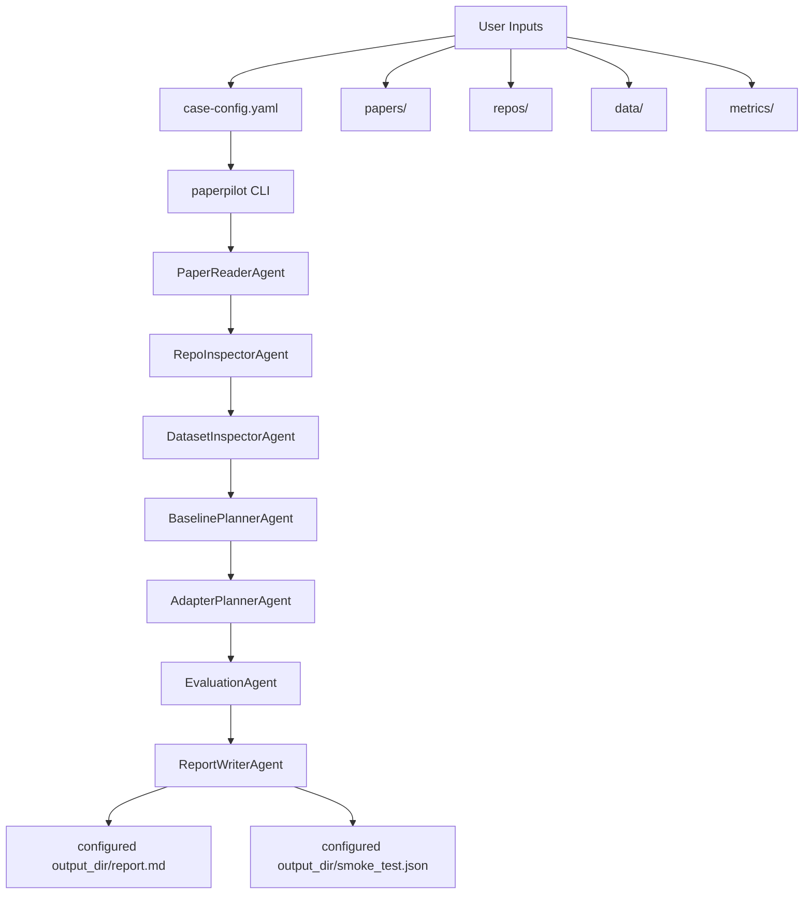

# PaperPilot-Agent

## Project Overview

PaperPilot-Agent is a human-in-the-loop research baseline and benchmark planning agent. Researchers provide papers, local method repositories, datasets, and metric configuration files. PaperPilot-Agent runs a small multi-agent CLI workflow that produces planning artifacts for dry-run experiment design and smoke-test validation.

It is designed to help structure baseline work before expensive training or reproduction attempts. It does not claim to fully reproduce arbitrary papers automatically.

## What PaperPilot-Agent Does

- Generates a lightweight paper summary.
- Inspects local method repositories for README files, dependency files, candidate entrypoints, examples, and warnings.
- Checks dataset structure and likely data, label, and coordinate files.
- Creates a baseline experiment plan.
- Plans method adapter interfaces for `prepare`, `run`, `collect_outputs`, and `evaluate`.
- Generates an evaluation protocol.
- Writes a final report and `smoke_test.json` trace.

## Agent Workflow

The default CLI workflow is config-driven and human-in-the-loop. It creates planning and review artifacts for baseline benchmark automation; it does not run arbitrary external training code automatically.



Note: Some helper / older-workflow agents remain in the repository, but they are not part of the default CLI execution path.

## Agent Responsibilities

| Agent | Default CLI? | Responsibility | Main artifact |
| --- | --- | --- | --- |
| `PaperReaderAgent` | Yes | Samples configured papers and records parser warnings. | `paper_summary.md` |
| `RepoInspectorAgent` | Yes | Inspects configured main and baseline repositories for README, dependency, and entrypoint hints. | `repo_inspection.md` |
| `DatasetInspectorAgent` | Yes | Checks dataset path and likely data, label, and coordinate files. | `dataset_check.md` |
| `BaselinePlannerAgent` | Yes | Builds the case-level baseline plan, unified output contract, run steps, and risks. | `baseline_plan.yaml` |
| `AdapterPlannerAgent` | Yes | Plans `prepare`, `run`, `collect_outputs`, and `evaluate` adapter interfaces. | `adapter_plan.md` |
| `EvaluationAgent` | Yes | Writes the shared evaluation protocol from configured metrics. | `evaluation_protocol.md` |
| `ReportWriterAgent` | Yes | Writes the final report and agent trace. | `report.md` |
| `CodeScannerAgent` | Legacy/helper | Produces deeper method-repo profiles and adapter-plan hints for the older workflow. | `repo_profiles/*.json`, `adapter_plans/*.md` |
| `ExperimentDesignerAgent` | Legacy | Builds a benchmark design from `examples/toy_regression/project.yaml`. | In-memory context |
| `BaselineBuilderAgent` | Legacy | Marks legacy baselines as built-in or external-adapter-required. | In-memory context |
| `RunnerPlannerAgent` | Legacy | Produces command and expected-output plans for the older workflow. | In-memory context |
| `ResultAnalystAgent` | Legacy | Summarizes provided or placeholder metric results. | In-memory context |
| `ConsistencyCheckerAgent` | Legacy | Checks task, metric, dataset, baseline, and runner-plan alignment in the older workflow. | In-memory context |
| `ReportGeneratorAgent` | Legacy | Generates markdown for the older workflow; the orchestrator writes it to `outputs/report.md`. | `outputs/report.md` |

## What It Does Not Do Yet

- It does not guarantee complete automatic reproduction of any paper.
- It does not guarantee automatic resolution of all environment or dependency issues.
- Real training usually requires method-specific adapters.
- Deep LLM-based paper and code understanding is optional future work, not required for the default deterministic workflow.

## Quick Start

```bash
git clone <repo-url>
cd paperpilot-agent
pip install -r requirements.txt
```

Place your materials under `inputs/`:

```text
inputs/papers/your_paper.pdf
inputs/repos/YourMethod/
inputs/repos/BaselineA/
inputs/datasets/your_dataset/
inputs/metrics/your_metrics.yaml
```

Create a case:

```bash
python -m paperpilot init-case my_baseline_case_001
```

Edit the generated file:

```text
cases/my_baseline_case_001/case_config.yaml
```

Run PaperPilot-Agent:

```bash
python -m paperpilot run cases/my_baseline_case_001/case_config.yaml
```

Read the report:

```text
outputs/my_baseline_case_001/report.md
```

## Input Layout

- `inputs/papers/`: paper PDFs or text exports.
- `inputs/repos/`: local method repositories for the main method and baselines.
- `inputs/datasets/`: local datasets or dataset folders.
- `inputs/metrics/`: metric configuration YAML files.

Large local inputs are ignored by Git by default. Keep private data local.

## Case Config

`case_config.yaml` describes one planning case:

- `case_name`: short case identifier.
- `task_name`: workflow task name, usually `baseline_planning`.
- `task_type`: research task type, such as spatial multi-omics integration, image classification, or time-series forecasting.
- `papers`: list of paper paths under `inputs/papers/`.
- `methods.main_method`: primary method name and local repo path.
- `methods.baselines`: baseline method names and local repo paths.
- `dataset`: dataset name and local path.
- `metrics.path`: metric YAML file path.
- `output_dir`: where generated artifacts should be written.
- `mode`: default mode is `dry_run`.

## Output Files

PaperPilot-Agent writes these files into the configured `output_dir`:

- `paper_summary.md`: paper source summary and parser warnings.
- `repo_inspection.md`: repository structure, dependency, entrypoint, and warning report.
- `dataset_check.md`: dataset structure and candidate data/label/coordinate files.
- `baseline_plan.yaml`: method inputs, outputs, run steps, metrics, and risk points.
- `adapter_plan.md`: adapter interface plan for each method.
- `evaluation_protocol.md`: comparison protocol and required aligned outputs.
- `report.md`: final human-readable summary and agent trace.
- `smoke_test.json`: machine-readable checks, agent inputs, outputs, and warnings.

## Example Command

```bash
python -m paperpilot run cases/my_baseline_case_001/case_config.yaml
```
