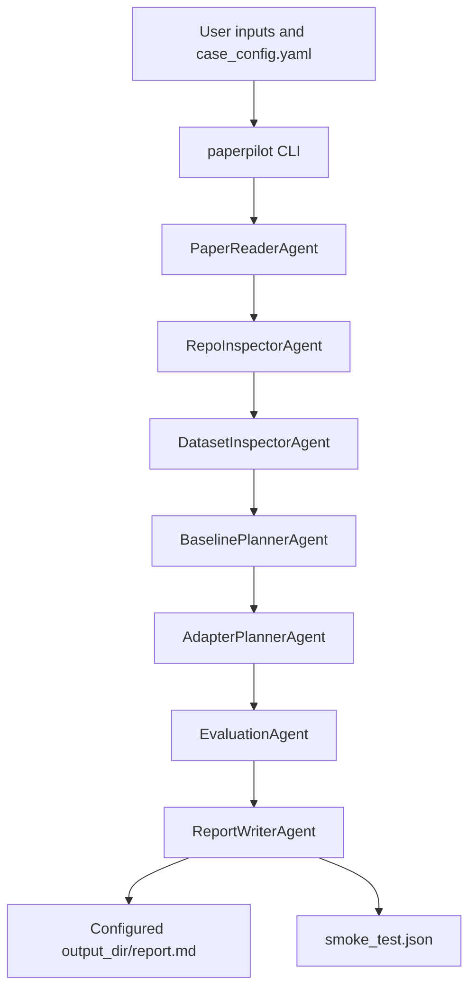

# PaperPilot-Agent Agent Audit

This audit reflects the repository state at the time of review. It separates the default CLI workflow from the older workflow module that is still present and tested.

## Executive Summary

- Default user entrypoint: `python -m paperpilot run <case_config.yaml>`, implemented by `paperpilot.cli` and `paperpilot.workflows.baseline_planning.BaselinePlanningWorkflow`.
- Default workflow agents: `PaperReaderAgent`, `RepoInspectorAgent`, `DatasetInspectorAgent`, `BaselinePlannerAgent`, `AdapterPlannerAgent`, `EvaluationAgent`, `ReportWriterAgent`.
- Default final report: the configured `output_dir` plus `report.md`, for example `outputs/my_baseline_case_001/report.md`. It is not always the top-level `outputs/report.md`.
- Legacy/test-covered workflow: `paperpilot.workflow.PaperPilotWorkflow`, used by tests with `examples/toy_regression/project.yaml`. It calls `PaperReaderAgent`, `CodeScannerAgent`, `ExperimentDesignerAgent`, `BaselineBuilderAgent`, `RunnerPlannerAgent`, `ResultAnalystAgent`, `ConsistencyCheckerAgent`, `ReportGeneratorAgent`.
- Main duplication risk: two workflow families exist with overlapping agent names and report-writing responsibilities.

## Entrypoints and Workflows

| Entrypoint | Status | Command or caller | Workflow class | Notes |
| --- | --- | --- | --- | --- |
| CLI run | Default | `python -m paperpilot run cases/<case>/case_config.yaml` or installed `paperpilot run ...` | `BaselinePlanningWorkflow` | Used by README and GitHub Actions. |
| CLI init | Default | `python -m paperpilot init-case <case_name>` | `BaselinePlanningWorkflow.init_case` | Creates `cases/<case_name>/case_config.yaml`. |
| Package main | Default | `python -m paperpilot ...` | `paperpilot.__main__` -> `paperpilot.cli.main` | Thin CLI wrapper. |
| Legacy orchestrator | Legacy/test-covered | `PaperPilotWorkflow().run(examples/toy_regression/project.yaml)` | `PaperPilotWorkflow` | Used by `tests/test_workflow_smoke.py`; not exposed by the CLI. |
| Example docs | Legacy-oriented | `python -m paperpilot.cli run examples/toy_regression/project.yaml` | Intended old workflow config, but current CLI expects case config | Documentation drift in `examples/toy_regression/README.md`. |

## Default CLI Workflow Call Chain

1. `paperpilot.cli.main`
2. `BaselinePlanningWorkflow.run(case_config_path)`
3. `PaperReaderAgent`
4. `RepoInspectorAgent`
5. `DatasetInspectorAgent`
6. `BaselinePlannerAgent`
7. `AdapterPlannerAgent`
8. `EvaluationAgent`
9. `ReportWriterAgent`
10. `BaselinePlanningWorkflow._write_smoke_test`

Generated artifacts in `output_dir`:

| Step | Artifact |
| --- | --- |
| Paper reader | `paper_summary.md` |
| Repo inspector | `repo_inspection.md` |
| Dataset inspector | `dataset_check.md` |
| Baseline planner | `baseline_plan.yaml` |
| Adapter planner | `adapter_plan.md` |
| Evaluation agent | `evaluation_protocol.md` |
| Report writer | `report.md` |
| Workflow smoke check | `smoke_test.json` |

## Agent Inventory

| File | Type | Main class/functions | Responsibility | Inputs | Outputs | Imported/called by | Test coverage | README main flow? |
| --- | --- | --- | --- | --- | --- | --- | --- | --- |
| `base.py` | Base/helper | `BaseAgent` | Abstract `run(context)` contract. | Shared context. | Updated context. | All agents inherit it. | Indirect through all agent tests. | No. |
| `paper_reader.py` | Business agent | `_extract_pdf_text`, `PaperReaderAgent` | Samples configured paper PDFs/text source and records warnings. Also supports legacy project config summaries. | Default: `context["config"]["papers"]`, `case_root`, `output_dir`. Legacy: `config["inputs"]["paper"]`. | Default: `paper_summary.md`, `context["paper_summary"]`, agent record. Legacy: `paper_summary`, `method_keywords`, `claimed_contributions`. | Default workflow, legacy workflow, tests. | `tests/test_agents.py`, legacy workflow smoke; default CLI covered through CI demo. | Yes. |
| `dataset_inspector.py` | Business agent | `DatasetInspectorAgent` | Checks dataset path, file count, common data files, label candidates, coordinate candidates, and warnings. | `config["dataset"]`, `case_root`, `output_dir`. | `dataset_check.md`, `context["dataset_check"]`, agent record. | Default workflow. | Default CLI path is exercised by CI demo; metric-focused tests do not assert content. | Yes. |
| `repo_inspector.py` | Business agent | `_rel`, `_files`, `RepoInspectorAgent` | Lightweight inspection of configured main and baseline method repos for README/dependency/entrypoint hints. | `config["methods"]`, `case_root`, `output_dir`. | `repo_inspection.md`, `context["repo_inspection"]`, agent record. | Default workflow. | Default CLI path is exercised by CI demo; no direct assertions. | Yes. |
| `code_scanner.py` | Business/advanced helper for legacy workflow | `inspect_method_repo`, `render_adapter_plan`, `CodeScannerAgent` | Deeper repo profiling for legacy project config; writes JSON repo profiles and per-method adapter-plan markdown. | Legacy `config["inputs"]["repository"]`, `config["method_repos"]`, `outputs.dir`. | `context["repo_profiles"]`, `repo_profiles/*.json`, `adapter_plans/*_adapter_plan.md`, entrypoint/dependency hints. | Legacy workflow and direct scanner tests. Not called by default CLI workflow. | `tests/test_repo_scanner.py`, `tests/test_agents.py`, legacy workflow smoke. | No for default flow; mention as legacy/optional helper only. |
| `baseline_planner.py` | Business agent | `BaselinePlannerAgent` | Builds the default case-level baseline plan from paper, repo, dataset, and metric checks. | `paper_summary`, `repo_inspection`, `dataset_check`, normalized metrics, `config["methods"]`. | `baseline_plan.yaml`, `context["baseline_plan"]`, agent record. | Default workflow. | Default CLI path is exercised by CI demo; no direct assertions. | Yes. |
| `experiment_designer.py` | Business agent, legacy | `ExperimentDesignerAgent` | Builds a legacy benchmark design from toy project config. | Legacy `config["task"]`, `dataset`, `metrics`, `baselines`. | `context["experiment_plan"]`. | Legacy workflow and agent test. | `tests/test_agents.py`, `tests/test_workflow_smoke.py`. | No for default flow. |
| `runner_planner.py` | Business agent, legacy | `RunnerPlannerAgent` | Produces a legacy command plan and expected outputs. | Legacy config path and optional `repo_profiles`. | `context["commands"]`, `execution_steps`, `expected_outputs`. | Legacy workflow and agent test. | `tests/test_agents.py`, `tests/test_workflow_smoke.py`. | No for default flow. |
| `adapter_planner.py` | Business agent | `AdapterPlannerAgent` | Converts the default `baseline_plan` into method adapter interface guidance. | `context["baseline_plan"]["plan"]["methods"]`, `output_dir`. | `adapter_plan.md`, `context["adapter_plan"]`, agent record. | Default workflow. | Default CLI path is exercised by CI demo; no direct assertions. | Yes. |
| `baseline_builder.py` | Business agent, legacy | `BaselineBuilderAgent` | Maps legacy baselines to built-in or external adapter status. | Legacy `config["baselines"]`. | `context["baseline_adapter_plan"]`. | Legacy workflow and agent test. | `tests/test_agents.py`, `tests/test_workflow_smoke.py`. | No for default flow. |
| `evaluation_agent.py` | Business agent | `EvaluationAgent` | Writes evaluation protocol based on normalized metrics and shared output contract. | `metric_names`, `metrics_warnings`, `metrics_path`, `config["task_type"]`, `output_dir`. | `evaluation_protocol.md`, `context["evaluation_protocol"]`, agent record. | Default workflow. | Default CLI path is exercised by CI demo; no direct assertions. | Yes. |
| `result_analyst.py` | Business agent, legacy | `ResultAnalystAgent` | Summarizes legacy provided/simulated metric rows and selects best method when numeric results exist. | Legacy `config["results"]`, `metrics`, `baselines`. | `best_method`, `metric_summary`, `interpretation`. | Legacy workflow and agent test. | `tests/test_agents.py`, `tests/test_workflow_smoke.py`. | No for default flow. |
| `consistency_checker.py` | Business agent, legacy | `ConsistencyCheckerAgent` | Checks legacy task/metric/baseline/dataset/runner alignment. | Legacy workflow context. | `warnings`, `passed_checks`. | Legacy workflow and agent test. | `tests/test_agents.py`, `tests/test_workflow_smoke.py`. | No for default flow. |
| `report_generator.py` | Business agent, legacy | `ReportGeneratorAgent` | Generates legacy markdown in memory for `PaperPilotWorkflow`. | Legacy full workflow context. | `context["report_markdown"]`; orchestrator writes `outputs/report.md`. | Legacy workflow and agent test. | `tests/test_agents.py`, `tests/test_workflow_smoke.py`. | No for default flow; mention as legacy. |
| `report_writer.py` | Business agent | `ReportWriterAgent` | Writes default final report and includes agent trace metadata. | Default full workflow context and agent records. | `report.md`, `context["report"]`, agent record. | Default workflow. | Default CLI path is exercised by CI demo; no direct assertions. | Yes. |
| `__init__.py` | Helper/export | agent imports, `__all__` | Exposes all agent classes. | N/A | Import surface. | Tests and legacy workflow import from it. | Import coverage via tests. | No. |

## Duplicate or Unclear Boundaries

### `repo_inspector.py` vs `code_scanner.py`

- Current reality: `RepoInspectorAgent` is the default CLI repo inspector. `CodeScannerAgent` is a deeper legacy scanner used by `PaperPilotWorkflow` and scanner tests.
- Overlap: both identify READMEs, dependency files, and candidate entrypoints.
- Difference: `RepoInspectorAgent` writes one default `repo_inspection.md` for all case methods; `CodeScannerAgent` writes per-repo JSON profiles and adapter plan markdown for legacy `method_repos`.
- Recommendation: keep `RepoInspectorAgent` as the default workflow module. Treat `inspect_method_repo` from `code_scanner.py` as a helper candidate for future `RepoInspectorAgent` enhancement. Avoid showing `CodeScannerAgent` as a default README flow step until it is wired into `BaselinePlanningWorkflow`.

### `report_generator.py` vs `report_writer.py`

- Current reality: `ReportWriterAgent` is the default CLI report step and writes `output_dir/report.md`. `ReportGeneratorAgent` is legacy and produces `context["report_markdown"]`, which `PaperPilotWorkflow` writes to `outputs/report.md`.
- Overlap: both assemble markdown reports from workflow context.
- Recommendation: keep `ReportWriterAgent` as the default module. Keep `ReportGeneratorAgent` as legacy/test-covered until the old workflow is retired or migrated.

### `baseline_planner.py`, `experiment_designer.py`, `runner_planner.py`

- Current reality: `BaselinePlannerAgent` is default and produces `baseline_plan.yaml`; `ExperimentDesignerAgent` and `RunnerPlannerAgent` are legacy.
- Boundary: default baseline planning combines methods, dataset, metrics, unified outputs, and risk points. Legacy experiment/runner planning splits benchmark design and command planning for `examples/toy_regression/project.yaml`.
- Recommendation: README should describe only `BaselinePlannerAgent` in the default flow. If runner planning is revived, add a default runner-plan artifact and wire it into `BaselinePlanningWorkflow`.

### `adapter_planner.py` vs `baseline_builder.py`

- Current reality: `AdapterPlannerAgent` is default and writes `adapter_plan.md`; `BaselineBuilderAgent` is legacy and only marks built-in versus external adapter status.
- Boundary: adapter planning is method-interface guidance; baseline builder is legacy registry/status mapping.
- Recommendation: keep `AdapterPlannerAgent` as default. Consider folding useful built-in/external status from `BaselineBuilderAgent` into the default baseline or adapter plan later.

## README Guidance

The README should avoid presenting the screenshot-style full chain as currently implemented. The accurate default flow is:

Optional/legacy modules should be listed separately, not shown as default flow steps.

## CI and Test Alignment

- GitHub Actions installs the package, runs `python -m pytest`, then runs `python -m paperpilot init-case ci_demo_case` and `python -m paperpilot run cases/ci_demo_case/case_config.yaml`.
- The CI workflow matches the default CLI workflow.
- Tests also cover the legacy `PaperPilotWorkflow`; this is useful coverage but can confuse documentation if presented as the main path.
- No code changes are required for CI based on this audit. Documentation should clearly separate default and legacy workflows.
